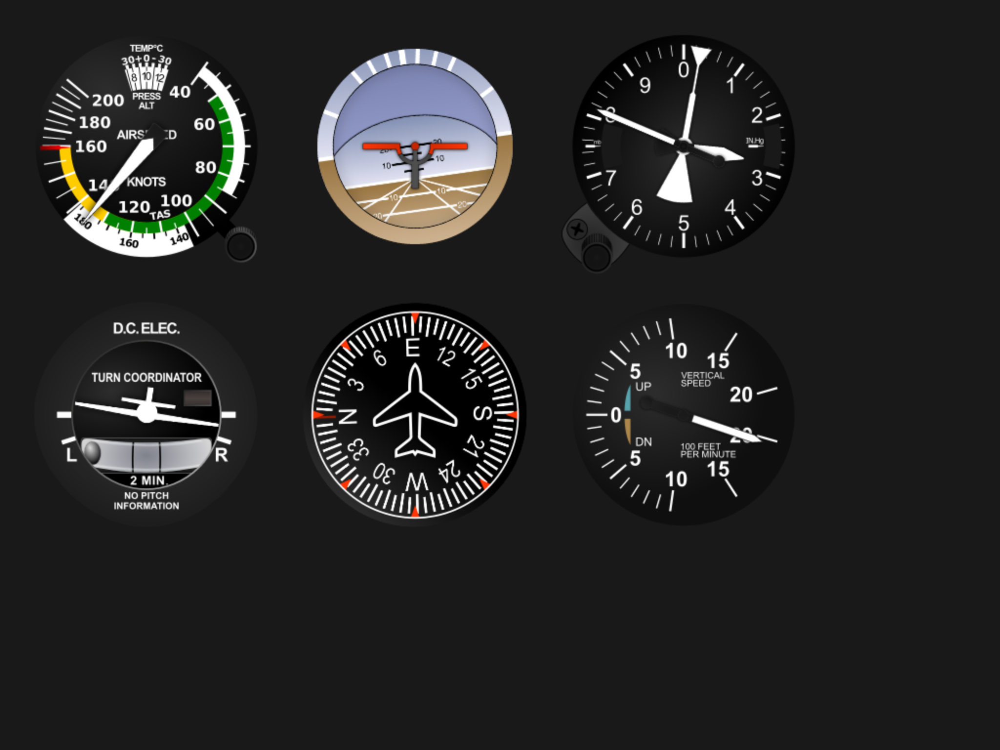

# OpenSimGauge

An open-source tool for rendering customizable gauge panels for MSFS 2020/2024
(and any other sim out there) - no coding needed, just config files and
PNGs/SVGs.

Works on Windows, macOS (ARM) and Linux.



Default 6 pack SVGs sourced from
[here](https://github.com/cecn/Skyhawk-Flight-Instruments/tree/master).

Inspired by
[Scott's instrument panel](https://github.com/scott-vincent/instrument-panel).

## Usage

1. Launch your flight sim
2. On the same PC run `server.exe`
3. On the same PC or another device (macOS and Linux supported) run your client
   (eg. `client.exe` on Windows)
4. Start a fight and the gauges should start animating

To create a custom panel and/or gauge you must define everything inside of
`config.json`.

## Client

### Config

| Property | Type            | Default | Description                                                                                                        |
| -------- | --------------- | ------- | ------------------------------------------------------------------------------------------------------------------ |
| `fps`    | `int`           | `60`    | The intended FPS when rendering.                                                                                   |
| `server` | `ServerConfig?` |         | Configure the server IP and port.                                                                                  |
| `panels` | `List<Panel>`   |         | The panels to render. On desktop a panel is a window.                                                              |
| `gauges` | `List<Gauge>`   | `[]`    | The gauges that are available to your panels. Optional because your panels can reference gauge JSON files by path. |
| `debug`  | `bool`          | `false` | Log extra info to the console.                                                                                     |

### ServerConfig

| Property    | Type     | Default       | Description |
| ----------- | -------- | ------------- | ----------- |
| `ipAddress` | `string` | `"127.0.0.1"` |             |
| `port`      | `int`    | `1234`        |             |

### Panel

| Property     | Type                               | Default          | Description                                                                                                                                                                                                 |
| ------------ | ---------------------------------- | ---------------- | ----------------------------------------------------------------------------------------------------------------------------------------------------------------------------------------------------------- |
| `name`       | `string`                           |                  | The name of this panel. Only used for debugging.                                                                                                                                                            |
| `gauges`     | `List<GaugeRef>`                   |                  | The gauges to render in this panel.                                                                                                                                                                         |
| `skip`       | `bool?`                            | `false`          | If to skip rendering this panel.                                                                                                                                                                            |
| `screen`     | `int?`                             | `0`              | The index of the screen you want to render this panel on (starting at 0 which is usually your main one).                                                                                                    |
| `width`      | `double?`                          |                  | The width of the panel in pixels or a percent of the screen.<br>Optional if you use fullscreen.                                                                                                             |
| `height`     | `double?`                          |                  | The width of the panel in pixels or a percent of the screen.<br>Optional if you use fullscreen.                                                                                                             |
| `fullscreen` | `bool`                             | `false`          | If to have the panel fill the screen.                                                                                                                                                                       |
| `position`   | `[double\|string, double\|string]` | `["50%", "50%"]` | The position of the panel inside the screen. X or Y can be a pixel value or a string which is a percent of the screen.<br>Use a negative value to flip the position (so -100 is 100px from the right edge). |
| `origin`     | `[double\|string, double\|string]` | `["50%", "50%"]` | The origin of the panel which is used for all transforms such as positioning, scaling and rotation.                                                                                                         |
| `background` | `string`                           | `rgb(0, 0, 0)`   | Background color of the panel as a CSS-like value. Cannot use transparency.<br>eg. "rgb(255, 255, 255)" or "#FFF" or "white"                                                                                |
| `debug`      | `bool?`                            | `false`          | Extra console logging for this panel.                                                                                                                                                                       |

### GaugeRef

An object that describes a reference to a gauge to render inside a panel.

| Property   | Type                               | Default  | Description                                                                                                                                                                                                  |
| ---------- | ---------------------------------- | -------- | ------------------------------------------------------------------------------------------------------------------------------------------------------------------------------------------------------------ |
| `name`     | `string?`                          |          | The name of the gauge to use. Optional if you specify a path.                                                                                                                                                |
| `path`     | `string?`                          |          | The path to a JSON file that contains the gauge to use.<br>The file should contain a single property "gauge" which is the Gauge object.                                                                      |
| `position` | `[double\|string, double\|string]` | `[0, 0]` | The position of the gauge inside the panel.<br>X or Y can be a pixel value or a string which is a percent of the panel.<br>Use a negative value to flip the position (so -100 is 100px from the right edge). |
| `scale`    | `double`                           | `1.0`    | How much to scale the gauge (respecting the width you set).                                                                                                                                                  |
| `width`    | `double?`                          |          | Force the width of the gauge in pixels before scaling.                                                                                                                                                       |
| `skip`     | `bool`                             | `false`  | If to skip rendering this gauge.                                                                                                                                                                             |

### Gauge

An object that describes a gauge and how to render it.

| Property | Type                               | Default          | Description                                                                                                                    |
| -------- | ---------------------------------- | ---------------- | ------------------------------------------------------------------------------------------------------------------------------ |
| `name`   | `string`                           |                  | The name of the gauge. Used for referencing it from a panel and for debugging.                                                 |
| `width`  | `int`                              |                  | The width of the gauge (in pixels).                                                                                            |
| `height` | `int`                              |                  | The height of the gauge (in pixels).                                                                                           |
| `origin` | `[double\|string, double\|string]` | `["50%", "50%"]` | The origin of the gauge which is used for all transforms such as positioning, scaling and rotation.                            |
| `layers` | `List<Layer>`                      |                  | The layers to render to make the gauge.                                                                                        |
| `clip`   | `ClipConfig?`                      |                  | How to clip the layers of the gauge. Useful for gauges like an attitude indicator that translates outside of the gauge bounds. |

### ClipConfig

An object that describes how to clip the layers of a gauge.

| Property   | Type                               | Default                      | Description                                                                                                            |
| ---------- | ---------------------------------- | ---------------------------- | ---------------------------------------------------------------------------------------------------------------------- |
| `image`    | `string`                           |                              | The path to the SVG to use to clip. It must contain a single path element (such as a circle).                          |
| `width`    | `double?`                          | `SVG viewbox width or 100%`  | The width of the SVG (in pixels).                                                                                      |
| `height`   | `double?`                          | `SVG viewbox height or 100%` | The width of the SVG (in pixels).                                                                                      |
| `origin`   | `[double\|string, double\|string]` | `["50%", "50%"]`             | The origin of the SVG for positioning.                                                                                 |
| `position` | `[double\|string, double\|string]` | `["50%", "50%"]`             | The position of the clip inside the gauge.<br>X or Y can be a pixel value or a string which is a percent of the gauge. |
| `debug`    | `bool`                             | `false`                      | Extra debugging for clipping.                                                                                          |

### Layer

An object that describes a layer of a gauge.

| Property     | Type                               | Default          | Description                                                                                                                                                                    |
| ------------ | ---------------------------------- | ---------------- | ------------------------------------------------------------------------------------------------------------------------------------------------------------------------------ |
| `name`       | `string?`                          |                  | The name of the layer. Only used for debugging.                                                                                                                                |
| `text`       | `TextDef?`                         |                  | Some text to render as this layer. If provided then `image` will be ignored.                                                                                                   |
| `image`      | `string?`                          |                  | A path to an image to render as this layer. PNG and SVG supported. If provided then `text` will be ignored.                                                                    |
| `width`      | `double?`                          |                  | The width of the layer (in pixels).                                                                                                                                            |
| `height`     | `double?`                          |                  | The height of the layer (in pixels).                                                                                                                                           |
| `origin`     | `[double\|string, double\|string]` | `["50%", "50%"]` | The origin of the layer (in pixels) for all transformations to be based on.                                                                                                    |
| `position`   | `[double\|string, double\|string]` | `["50%", "50%"]` | The position of the layer inside the gauge.<br>X or Y can be a pixel value or a string which is a percent of the gauge.                                                        |
| `transform`  | `TransformDef?`                    |                  | How to transform this layer using a SimVar.                                                                                                                                    |
| `rotate`     | `double`                           | `0`              | How many degrees to initially rotate the layer.                                                                                                                                |
| `translateX` | `double`                           | `0`              | How much to initially translate the layer on the X axis.                                                                                                                       |
| `translateY` | `double`                           | `0`              | How much to initially translate the layer on the Y axis.                                                                                                                       |
| `debug`      | `bool`                             | `false`          | Render useful debugging visuals such as bounding box.<br>Note: If you subscribe to a SimVar in this layer and debugging is enabled it is sent to the server for extra logging. |
| `skip`       | `bool?`                            | `false`          | If to skip rendering this layer.                                                                                                                                               |

### TextDef

An object that describes what kind of text to render in the layer.

| Property     | Type               | Default | Description                                                                                                                                                                                                 |
| ------------ | ------------------ | ------- | ----------------------------------------------------------------------------------------------------------------------------------------------------------------------------------------------------------- |
| `var`        | `[string, string]` |         | How to subscribe to a SimVar (and its unit) as the source of the text. eg. ["AIRSPEED INDICATED", "knots"]<br>Note all vars are requested as floats so units like "position" -127..127 are mapped to -1..1. |
| `default`    | `string?`          |         | The default text to render when there is no SimVar value.                                                                                                                                                   |
| `fontSize`   | `double`           | `64`    | The size of the text.                                                                                                                                                                                       |
| `fontFamily` | `string?`          |         | The family of the text. Supports any system font plus any inside the `fonts/` directory (currently only "Gordon").<br>If you specify a font path this lets you choose a family inside it.                   |
| `font`       | `string?`          |         | Path to a font file to use. Relative to the config JSON file.                                                                                                                                               |
| `color`      | `ColorDef?`        |         | The color of the text as a CSS-like value.<br>eg. "rgb(255, 255, 255)" or "#FFF" or "white"                                                                                                                 |

### TransformDef

An object that describes how to transform a layer using SimVars.

| Property     | Type               | Default | Description |
| ------------ | ------------------ | ------- | ----------- |
| `rotate`     | `RotateConfig?`    |         |             |
| `translateX` | `TranslateConfig?` |         |             |
| `translateY` | `TranslateConfig?` |         |             |
| `path`       | `PathConfig?`      |         |             |

### CalibrationPoint

| Property  | Type     | Default | Description |
| --------- | -------- | ------- | ----------- |
| `value`   | `double` |         |             |
| `degrees` | `double` |         |             |

### TransformConfig

How to transform a layer using a SimVar.

| Property      | Type                      | Default | Description                                                                                                                                                                      |
| ------------- | ------------------------- | ------- | -------------------------------------------------------------------------------------------------------------------------------------------------------------------------------- |
| `var`         | `[string, string]`        |         | The SimVar and its unit to subscribe to. eg. ["AIRSPEED INDICATED", "knots"]<br>Note all vars are requested as floats so units like "position" -127..127 are mapped to -1..1.    |
| `from`        | `double?`                 |         | The minimum to translate/rotate. If the value is 50% the from->to then it will render at 50% from->to.                                                                           |
| `to`          | `double?`                 |         | The maximum to translate/rotate. If the value is 50% the from->to then it will render at 50% from->to.                                                                           |
| `min`         | `double?`                 |         | The minimum possible value for the SimVar. eg. for airspeed it would be 0 for 0 knots                                                                                            |
| `max`         | `double?`                 |         | The maximum possible value for the SimVar.                                                                                                                                       |
| `invert`      | `bool`                    | `false` | If to invert the resulting rotation/translation.                                                                                                                                 |
| `multiply`    | `double?`                 |         | How much to multiply the SimVar amount by. Useful to convert "feet per second" into "feet per minute".                                                                           |
| `calibration` | `List<CalibrationPoint>?` |         | How to "calibrate" raw SimVar values to specific angles because there is not a linear relationship.<br>Some gauges are not linear so require calibration (such as the C172 ASI). |
| `skip`        | `bool?`                   |         | If to skip applying this transform.                                                                                                                                              |
| `debug`       | `bool?`                   |         | Extra logging. Beware of console spam!                                                                                                                                           |
| `override`    | `double?`                 |         | Force a SimVar value for debugging purposes.                                                                                                                                     |

### RotateConfig

An object that describes how a layer should rotate. Inherits from
`TransformConfig`.

| Property | Type   | Default | Description                                                                      |
| -------- | ------ | ------- | -------------------------------------------------------------------------------- |
| `wrap`   | `bool` | `false` | If to allow the rotation to "wrap" around 360 degrees such as with an altimeter. |

### PathConfig

An object that describes how a layer should translate along a path. Inherits
from `TransformConfig`.

| Property   | Type                               | Default                      | Description                                                                                                             |
| ---------- | ---------------------------------- | ---------------------------- | ----------------------------------------------------------------------------------------------------------------------- |
| `image`    | `string`                           |                              | The path to an SVG to use. It must contain a single path element.                                                       |
| `width`    | `double?`                          | `SVG viewbox width or 100%`  | The width of the SVG (in pixels).                                                                                       |
| `height`   | `double?`                          | `SVG viewbox height or 100%` | The width of the SVG (in pixels).                                                                                       |
| `origin`   | `[double\|string, double\|string]` | `["50%", "50%"]`             | The origin of the SVG for positioning.                                                                                  |
| `position` | `[double\|string, double\|string]` | `["50%", "50%"]`             | The position of the image inside the gauge.<br>X or Y can be a pixel value or a string which is a percent of the gauge. |

## Creating SVGs

There is a Python script to generate a SVG per layer of a gauge using
"operations". Usually an operation equals a SVG node. Each operation is
described in the script's README.md.

```cli
python3 tools/create-svg-gauge.py gauges/rpm_piper_seminole/svg.json gauges/rpm_piper_seminole
```

## Fonts

When using a text layer you can specify any system font or one of these special
ones bundled with the client:

- [Gordon](http://www.identifont.com/show?62D)

## Server

### Config

Configuration of the server application that runs on the host machine.

| Property | Type                         | Default        | Description                                                                                                    |
| -------- | ---------------------------- | -------------- | -------------------------------------------------------------------------------------------------------------- |
| `source` | `'SimConnect' \| 'emulator'` |                | Which data source to use.                                                                                      |
| `server` | `ServerConfig`               | `ServerConfig` | Override the default IP address and port of the server.                                                        |
| `rate`   | `double`                     | `16.7`         | Override the default poll rate the data source should use (which is also network send rate).<br>16.7ms = 60Hz. |
| `debug`  | `bool`                       | `false`        | Log extra output to help diagnose issues.                                                                      |

### ServerConfig

Override the default IP address and port of the server.

| Property    | Type     | Default     | Description |
| ----------- | -------- | ----------- | ----------- |
| `ipAddress` | `string` | `"0.0.0.0"` |             |
| `port`      | `int`    | `1234`      |             |

## Development

```cli
cd ./client/src
dotnet run

cd ./server/src
dotnet run
```

### macOS

```cli
brew install --cask dotnet-sdk
```

### Linux

todo

## Building

Use the dotnet CLI to build for Windows, macOS and Linux.

On Windows you can just run `client/build.ps1` to build each platform.

## FAQ

### Can I create my own client?

Yes - it just needs to connect over TCP to the server, broadcast the correct
initialization message as JSON and the server will start sending it the SimVars.

```json
{
  "type": "Init",
  "payload": {
    "simvars": [
      {
        "name": "AIRSPEED INDICATED",
        "unit": "knots"
      }
    ]
  }
}
```

```json
{
  "type": "Var",
  "payload": {
    "name": "AIRSPEED INDICATED",
    "unit": "knots",
    "value": 123
  }
}
```

### Can I use this with my train or some other sim?

Yes - you just need to creae a new data source in the server and change your
`config.json` to use it:

```c#
    public class MyAwesomeTrainSim : IDataSource
    {
        // a function called whenever a gauge layer wants to subscribe to a variable
        public void SubscribeToVar(string varName, string unit, Action<object> callback);

        bool IsConnected { get; set; } // if connected or not

        void Connect() {
          // connect to the game's API
        }
        void Disconnect() {
          // disconnect (called when all clients have disconnected)
        }
        void Listen(Config config) {
          // start a loop to request data from the game (optional)
        }
    }
}
```

## Ideas

- better interpolation of values for smoother updates
- send `config.json` to clients to remote update
- Android/iOS app
- add JSON validation for better UX
- visual editor for panels/gauge
