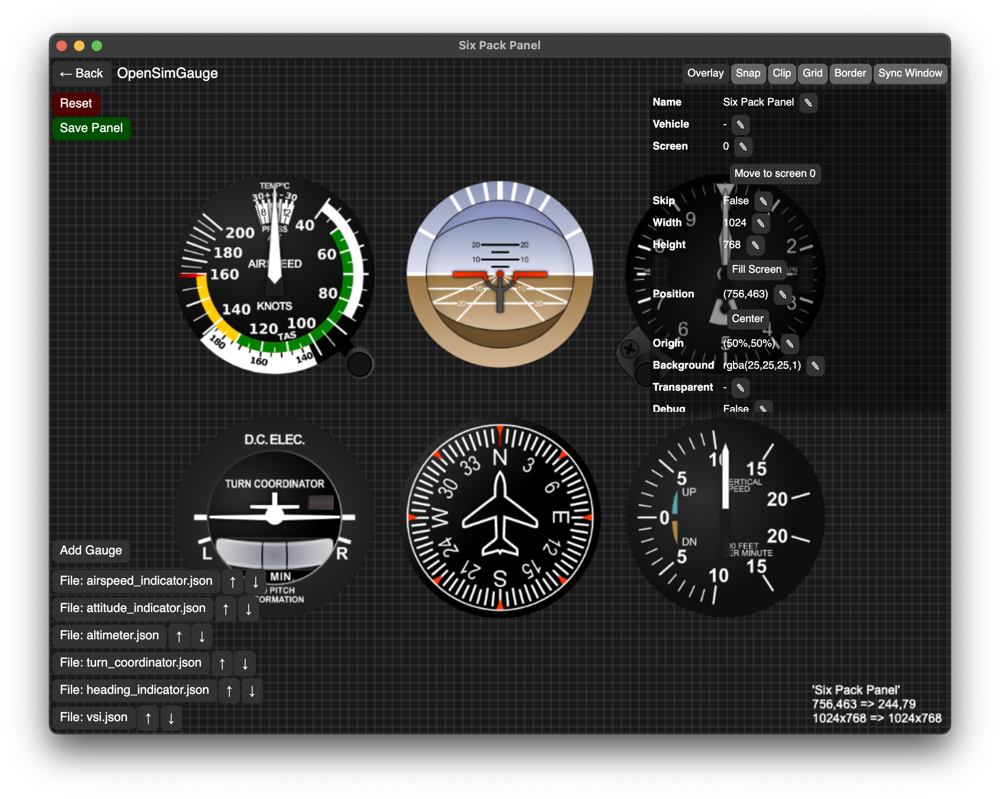

# OpenSimGauge

A free, open-source, cross-platform app to display panels that contain gauges
that are declared in simple config files with PNGs and SVGs, for use with
simulators like MSFS2020/2024.

✅ GUI for editing panels and gauges\
✅ vector-based using SVGs (can also use PNGs)\
✅ no coding required to create a panel or gauge\
✅ defaults to SimConnect but any game is supported (with coding)

 

Tested with MSFS2020 on Windows 10 and macOS ARM (M4).

Default 6 pack SVGs sourced from
[here](https://github.com/cecn/Skyhawk-Flight-Instruments/tree/master).

Inspired by
[Scott's instrument panel](https://github.com/scott-vincent/instrument-panel).

## Usage

1. Launch your flight sim
2. On the same PC run `server.exe`
3. On the same PC or another device (macOS and Linux supported) run your client
   (eg. `client.exe` on Windows)
4. Start a fight and the gauges should start animating

To create a custom panel and/or gauge you must define everything inside of
`config.json`.

## Config

See [client/README.md](./client/README.md) or See
[server/README.md](./server/README.md).

## Example gauge

This gauge is provided in the default config but skipped. It assumes the server
uses "cpu" data source:

```json
{
  "panels": [
    {
      "name": "System Info",
      "width": 400,
      "height": 400,
      "gauges": [
        {
          "name": "cpu",
          "position": [
            "50%",
            "50%"
          ]
        }
      ]
    }
  ],
  "gauges": [
    {
      "name": "cpu",
      "width": 400,
      "height": 400,
      "layers": [
        {
          "position": [
            "50%",
            "33.3%"
          ],
          "text": {
            "default": "CPU"
          }
        },
        {
          "position": [
            "50%",
            "66.6%"
          ],
          "text": {
            "var": [
              "CPU",
              "percent"
            ],
            "template": "{0:F1}%",
            "default": "---"
          }
        }
      ]
    }
  ]
}
```

## Development

This project was created entirely using VSCode (with the C# and C# Dev Kit
extensions) and the dotnet CLI.

1. Clone repo
2. Open `./client/src/client` in VSCode (and install C# and C# Dev Kit
   extensions)
3. Run `dotnet restore ./client/src/client`
4. Run with `dotnet run --project ./client/src/client`
5. Build with the bash script `bash ./client/build.sh` or use the dotnet CLI

Repeat for the server.

## FAQ

### Can I create my own client?

Yes - it just needs to connect over TCP to the server, broadcast the correct
initialization message as JSON and the server will start sending it the SimVars.

See server/src/server/Messages.cs for all possible messages.

```json
{
  "type": "Init",
  "payload": {
    "vehicleName": "Cessna 172", // the last known vehicle (it will send a ReInit message if wrong)
    "vars": [
      {
        "name": "AIRSPEED INDICATED",
        "unit": "knots"
      }
    ],
    "events": [
      "SOME_COOL_EVENT"
    ]
  }
}
```

```json
{
  "type": "Var",
  "payload": {
    "name": "AIRSPEED INDICATED",
    "unit": "knots",
    "value": 123
  }
}
```

### Can I use this with my train or some other sim?

Yes it's very possible - just create a new dotnet project, depend on
`OpenSimGaugeAbstractions.csproj`, create a class that implements `IDataSource`
and place the DLL (and any other dependencies) into the client directory.

## Contribution

Please submit a PR with screenshots.
